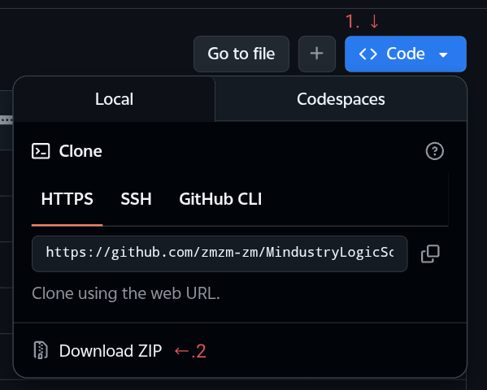

# Mindustry Logic Script
**See an English version at [this](./README_EN.md)**  
**README last modified: 26.6.19**

This repository provides a compiler  
that converts **mls** script language into **Mindustry Logic** (the logic system in the game Mindustry).

For general information, see the [Wiki](#Wiki).

## About mls
- **mls is not any existing programming language**  
  Any name collision or similarity is purely coincidental.  
  For detailed syntax, see [this repository's Wiki](https://zmzm-zm.github.io/MindustryLogicScript).

- **mls is not a general-purpose programming language**  
  It is designed to simplify writing Mindustry Logic and provide higher-level features.  
  After being translated into Mindustry Logic, it runs inside the game.  
  Therefore, it cannot be compiled into assembly code by a compiler.  
  However, it does have basic logic, control flow statements, etc.,  
  and provides various syntactic sugars and functional templates, packaging common logic and features into functions.

- **mls is an untyped language**  
  Because type checking is left to the game runtime,  
  and Mindustry Logic itself is weakly typed,  
  even writing `"Hello World" / 3` will not cause a compilation error.  
  **However, this is under consideration** —  
  we plan to check for impossible operations like `"Hello World" / 3`.

> **Currently under development; only a very few features are available.**

## How to Use
- Download the compiler from the [releases page](https://github.com/zmzm-zm/MindustryLogicScript/releases) of this repository.
  > If there is no release yet, that means the initial version hasn't been built.

- Set up environment variables so that the command can be found.

- Run the compilation command, for example:  
  ~~~
  mls output input1.mls input2.mls
  ~~~
  The first argument is the output file name,  
  and the second and subsequent arguments are input files.  
  **Currently only single-file input is supported**; additional files will be ignored.

- The resulting `output.ml` file is the compiled output.  
  Copy and paste it into the game to use it.
  > Currently, the output is still native Mindustry Logic.  
  > Blueprint support will be added in the future.

## Wiki
### Statement
The Wiki page code in this project was created with the assistance of AI (i.e., a large language model was used for code generation), because I am not a frontend developer.  
However, all functional code has been manually tested and reviewed, and all documentation content (i.e., all `.md` files) has been written manually.

**What I want to say is:** if you like the style of this webpage, feel free to [take and use it](#usage).  
**But you must give proper attribution**, even though most of it was generated by AI — I still put in effort debugging, testing, refining, etc.

For specific details, see [this repository's Wiki](https://zmzm-zm.github.io/MindustryLogicScript).  
If you [cannot open the Wiki page](#viewing-the-wiki-locally).

### Viewing the Wiki Locally
If you cannot access the Wiki page due to network restrictions,  
you can view it locally as follows:
> Requires Linux command line.

1. Obtain the files:
	- Download from the browser page:  
	  
	- Download from the [Releases page](https://github.com/zmzm-zm/MindustryLogicScript/releases)
	- Download using git:  
	  ~~~
	  git clone https://github.com/zmzm-zm/MindustryLogicScript
	  ~~~

2. Enter the `wiki` folder:  
   ~~~
   cd MindustryLogicScript/wiki
   ~~~

3. Start a local server:
	- Using Python 3:  
	  ~~~
	  python3 -m http.server 8080
	  ~~~
	  If Python is not installed, install it first:  
	  ~~~
	  sudo apt install python
	  ~~~
	- Using Node.js:  
	  ~~~
	  http-server
	  ~~~
	  You need to install Node.js and http-server first:  
	  ~~~
	  sudo apt install nodejs npm
	  npm install -g http-server
	  ~~~

4. Access:
	- Using Python 3:  
	  Enter `http://localhost:8000/index.html` in your browser.
	- Using Node.js:  
	  Enter `http://127.0.0.1:8080/index.html` in your browser.

### Usage
It is recommended to use Node.js.  
Run the server in the Wiki root directory, having installed Node.js and http-server beforehand:  
~~~
~/wiki $ http-server
~~~
If you modify or add `.md` files, please run [generate-manifest.js](./wiki/generate-manifest.js).  
The file contains detailed instructions.

Example execution and output:  
~~~
~/wiki $ node generate-manifest.js
[generate-manifest] manifest.json generated
Root files: 1
Groups:     2
Total docs: 4
~~~
> Note: it only supports one level of directories, i.e., under `docs` there can be at most one more level. This is because I am unsure how to display multi-level directories, and I have no such need. If you want deeper nesting, you may try to implement the relevant logic.

#### Possible Troubleshooting
- You changed the webpage logic but nothing happens?  
  If you are using Edge, try `Ctrl+Shift+R` to force refresh, or clear the browser cache for this Wiki page.  
  For other browsers, I am not sure if `Ctrl+Shift+R` works, but clearing the cache for this Wiki page should be effective.  
  ~~This ridiculous bug wasted an entire afternoon. Imagine adding a bunch of `console.log()` statements but seeing no output in the console.~~